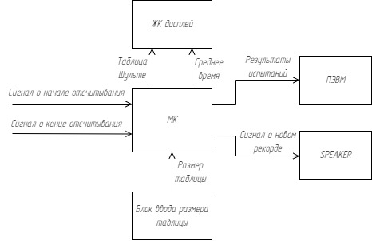

## Таблица Шульте - курсовая работа по МПС
> Студент ИУ6-74Б Валиуллин Тимур
## Задание:
Разработать МК-систему для измерения скорости чтения человека. Необходимо отобразить таблицу Шульте на ЖК-дисплее. Предусмотреть оторбражение нескольких вариантов таблиц (текущий вариант выбирает испытуемый). Пользователь фиксирует время старта и окончания теста при помощи управляющих кнопок. Предоставить возможность сохранять время испытания в памяти. При установлении нового рекорда, посылать сигнал на SPEAKER.
  
По результатам нескольких испытаний определить средняя время чтения испытуемого и выводить его на индикатор. Результаты испытаний передать по последовательному каналу в ПЭВМ.
  
Выбрать наиболее оптимальный вариант МК. Выбор обосновать.
  
Разработать схему, алгоритмы и программу. Отладить проект в симуляторе или на макете. Оценить потребляемую мощность. Описать принципы и технологию программирования используемого микроконтроллера.

## Структурная схема:
Согласно заданию была создана структурная схема, отображающая общую структуру разрабатываемой МПС:

Пояснения:
- Сигналы о начале/конце считывания - нажатия пользователем соответствующих кнопок;
- Блок ввода размера таблицы - таблица из себя представляет матрицу NxN с числами от 1 до N^2, при этом N от 3 до 7. Блок ввода представляет собой 5 кнопок для выбора размера (от 3 до 7 соответственно);
- Остальные компоненты в пояснении не нуждаются.

## Компоненты:
Итого нужны следующие компоненты:
- Микроконтроллер;
- Дисплей;
- Спикер;
- 7 кнопок.
